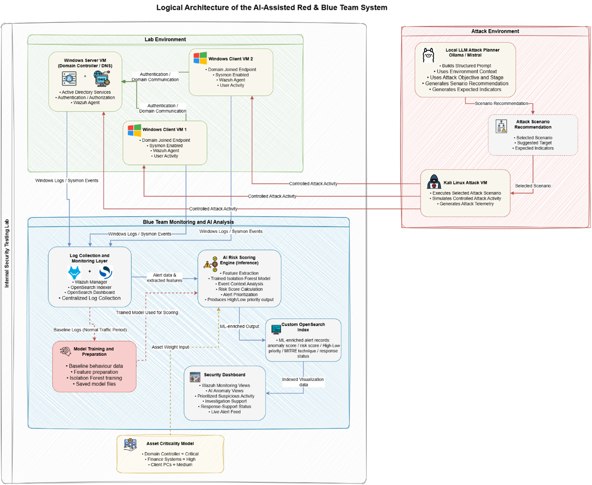

# AI-RedBlue-Alert-Prioritization

**An AI-Assisted Red & Blue Team System for Internal Network Penetration Testing
and Security Monitoring.**

Final Year Project — (Cybersecurity)

---

## Project Overview

This project designs and implements a controlled AI-assisted Red and Blue Team
cybersecurity system for the Oman branch of Scientific Pharmacy LLC. The system
combines LLM-assisted attack planning, Wazuh-based SIEM monitoring, and an
Isolation Forest ML pipeline to detect anomalies and prioritize security alerts
in a virtualized lab environment.

---

## System Architecture



The system consists of three environments:

- **Lab Environment** — Windows Server 2025 (DC01) + 2 Windows client endpoints
  (FINANCE-PC01, IT-PC01), running Sysmon and Wazuh agents, simulating the
  Scientific Pharmacy Oman branch internal network
- **Attack Environment** — Kali Linux with LLM-assisted scenario planning via
  Ollama (Mistral model); controlled execution of credential spraying, targeted
  brute force, lateral movement, and domain enumeration
- **Blue Team Analysis** — Wazuh SIEM + Isolation Forest ML pipeline +
  OpenSearch Dashboard for near real-time alert prioritization

---

## Repository Structure

```
AI-RedBlue-Alert-Prioritization/
│
├── red_team/
│   └── llm_planner.py                   # LLM-based attack scenario planner (Ollama/Mistral)
│
├── blue_team/
│   ├── live_wazuh_priority_scorer.py    # Live ML scoring pipeline
│   ├── isolation_forest_dataset_B.pkl   # Trained Isolation Forest model
│   ├── standard_scaler_dataset_B.pkl    # Feature scaler
│   ├── feature_columns_dataset_B.pkl    # Feature column definitions
│   ├── score_calibration_dataset_B.pkl  # Score calibration data
│   ├── seen_ids.txt                     # Tracked processed event IDs
│   └── seen_incidents.txt               # Tracked processed incidents
│
├── notebooks/
│   └── isolation_forest_training.ipynb  # Full ML training notebook
│
├── dataset/
│   └── dataset_B.csv                    # Wazuh-aligned lab-generated dataset
│
├── diagrams/
│   └── logical_architecture.png         # Logical system architecture
│
├── outputs/                             # Score distributions, confusion matrix, ROC curve
├── figures/                             # Implementation screenshots
│
├── requirements.txt
└── README.md
```

---

## Attack Scenarios Implemented

| Scenario | MITRE Technique | Tool Used |
|----------|----------------|-----------|
| Credential Spraying | T1110 | netexec |
| Targeted Brute Force | T1110.001 | netexec |
| Lateral Movement via SMB | T1021 | impacket-smbexec |
| Domain Enumeration & SAM Dump | T1087 / T1003 | netexec --sam |

---

## ML Pipeline

- **Model:** Isolation Forest (unsupervised anomaly detection)
- **Dataset:** Lab-generated Wazuh-aligned events (Dataset B)
- **Features:** Failed logon count, successful logon count, logon type,
  unique users targeted, distinct hosts accessed, after-hours activity,
  remote logon, asset criticality, Windows event indicators
- **Risk Score:** Combines anomaly score + Wazuh rule level + asset
  criticality + event context
- **Output:** High/Low priority label, MITRE ATT&CK mapping,
  response-support status, anomaly score, final risk score

---

## Dashboard

Built in OpenSearch Dashboards on top of a custom `live-priority-alerts` index.

Visualizations include:
- Anomaly timeline (High vs Low priority over time)
- Alerts by host
- MITRE ATT&CK technique breakdown
- AI priority output distribution
- High-priority alerts by user
- Average risk score metric
- Live alert feed

---

## How to Run

### Prerequisites
```bash
pip install -r requirements.txt
```
For the Red Team module, Ollama must be running locally with Mistral pulled:
```bash
ollama run mistral
```

### Blue Team — Training
Open and run `notebooks/isolation_forest_training.ipynb`

### Blue Team — Live Scoring
```bash
python blue_team/live_wazuh_priority_scorer.py
```

### Red Team — Scenario Planning
```bash
# Requires Ollama running at http://localhost:11434
python red_team/llm_planner.py
```

---

## Lab Environment

| Machine | Role |
|---------|------|
| Wazuh Server | SIEM / Monitoring |
| DC01 | Domain Controller (AD) |
| FINANCE-PC01 | Windows Client |
| IT-PC01 | Windows Client |
| Kali Linux | Red Team Attack Machine |

Domain: `lab.local`

---

## Tools & Technologies

| Category | Tool |
|----------|------|
| Virtualization | VMware Workstation |
| SIEM | Wazuh + OpenSearch |
| Endpoint Monitoring | Sysmon + Wazuh Agent |
| Red Team Execution | Kali Linux, netexec, Impacket |
| LLM Planning | Ollama (Mistral 7B) |
| ML Library | Scikit-learn, Pandas, NumPy |
| Dashboard | OpenSearch Dashboards |
| Language | Python 3.10+ |